# Проектная работа

## Подготовка инфраструктурной платформы для демо-приложения Online Boutique by Google

# Общее описание

В данной работе будем реализовывать платформу для работы приложения на kubernetes self-hosted на основе виртуальных машин.
Для реализации проекта было развернуто 6 виртуальных машин на ОС Debian/Ubuntu:

1. Одна управляющая машина (mgm). Данная машина предоставляет:
  - консоль управления кластером с установленными kubectl, k9s, helm, ansible, kubespray
  - сервер Gitlab и gitlab-runner для реализации pipeline развертывания платформы, средствами ansible и скриптами bash
2. Пять нод кластера kubernetes (node1-5):
  - node1-3 - Control Plane Nodes, управляющие/инфраструктурные ноды с сервисами мониторинга, логирования (Promtail-Loki-Grafana) и доставки приложения (Argo-CD)
  - node4-5 - Worker Nodes, рабочие ноды для функционирования приложения (Online Boutique by Google) и хранилища S3 (Minio)

# Управляющая машина

## Установка и настройка компонентов

### Установка k9s через pkgx

Установка pkgx
```sh
curl -Ssf https://pkgx.sh | sh
```
Установка и запуск k9s
```sh
pkgx k9s
```

### Установка helm
```sh
curl https://baltocdn.com/helm/signing.asc | gpg --dearmor | sudo tee /usr/share/keyrings/helm.gpg > /dev/null
apt-get install apt-transport-https --yes
echo "deb [arch=$(dpkg --print-architecture) signed-by=/usr/share/keyrings/helm.gpg] https://baltocdn.com/helm/stable/debian/ all main" | sudo tee /etc/apt/sources.list.d/helm-stable-debian.list
apt-get update
apt-get install helm
```
### Kubespray и Ansible
Для процедуры bootstrap кластера выбрано программное обеспечение kubespray:
https://github.com/kubernetes-sigs/kubespray

Для обеспечения стабильности и хранения настроек нашего кластера был сделан форк:
https://github.com/slv-alt/kubespray.git

Настройка kubespray, установка ansible  
Установка pip:
```sh
apt-get install pip  
```
Клонируем форк:
```sh
git clone https://github.com/slv-alt/kubespray.git
```
Устанавливаем зависимости, ansible
```sh
cd kubespray
pip3 install -r requirements.txt --break-system-packages
```
Делаем копию конфигурационного каталога
```sh
cp -rfp inventory/sample inventory/mycluster
```
Объявляем список IP-адресов наших нод, формируем файл hosts.yaml
```sh
declare -a IPS=(192.168.1.31 192.168.1.32 192.168.1.33 192.168.1.34 192.168.1.35)
CONFIG_FILE=inventory/mycluster/hosts.yaml python3 contrib/inventory_builder/inventory.py ${IPS[@]}
```
Меняем настройки кластера
  - inventory/mycluster/group_vars/k8s_cluster/addons.yaml
     - Установка Helm: helm_enabled: false -> true
     - Метрики: metrics_server_enabled: false -> true
     - Провижининг LocalPath и LocalVolume:
         - local_path_provisioner_enabled: false -> true
         - local_volume_provisioner_enabled: false -> true
     - Плагины: krew_enabled: false -> true
  - inventory/mycluster/group_vars/k8s_cluster/k8s-cluster.yml
     - Сетевой плагин: kube_network_plugin: flannel
     - Настройка, необходимая для работы MetalLB: kube_proxy_strict_arp: true
  - inventory/mycluster/group_vars/k8s_cluster/k8s-net-flannel.yml
      - flannel_interface_regexp: '192\\.168\\.1\\.\\d{1,3}'
      - flannel_backend_type: "host-gw"

Развернуть новый кластер
```sh
ansible-playbook -i inventory/mycluster/hosts.yaml --become --become-user=root cluster.yml
```

Обновить кластер, например если изменить устанавливаемые компоненты в inventory/mycluster/group_vars/k8s_cluster/addons.yml
```sh
inventory/mycluster/group_vars/k8s_cluster/addons.yml
ansible-playbook -i inventory/mycluster/hosts.yaml --become --become-user=root upgrade-cluster.yml
```

Сброс (удаление) кластера
```sh
ansible-playbook -i inventory/mycluster/hosts.yaml --become --become-user=root reset.yml
```
В процессе многочисленных развертываний кластера, с какого-то момента процесс установки кластера стал завершаться ошибкой
на одной из нод Control Plane. Ошибка была вида:  
The conditional check 'kubeadm_certificate_key is not defined' failed. The error was: An unhandled exception occurred while templating '{{ lookup('password', credentials_dir + '/kubeadm_certificate_key.creds length=64

Ошибка имела не постоянный характер и могла появиться на одной из нод или сразу нескольких. Какие-либо изменения не помогали, пока не был найден патч:
https://github.com/kubernetes-sigs/kubespray/pull/10523/files

Данный патч применен в моем форке репозитория Kubespray: https://github.com/slv-alt/kubespray/blob/master/roles/kubernetes/control-plane/tasks/kubeadm-setup.yml

Bootstrap кластера автоматизирован скриптом:  https://github.com/slv-alt/prowork/blob/main/bootstrap/bootstrap.sh  
Аналогичный сценарий реализован в pipeline этапе bootstrap.  
В этой же папке находятся конфигурационные файла kubespray, которые были изменены в данном проекте.

Также для управления нодами предусмотрены несколько вспомогательных плейбуков в каталоге:  
https://github.com/slv-alt/prowork/tree/main/ansible

Например, перезагрузить все ноды:  
```sh
ansible-playbook -i inventory.yaml play-reboot.yaml
```

## Gitlab
Каталог с конфигурациями и скриптами:  
https://github.com/slv-alt/prowork/tree/main/gitlab

### Gitlab-server
Gitlab server будем устанавливать через Docker.

### Установка Docker
```sh
apt-get update
apt-get install ca-certificates curl gnupg
curl -fsSL https://download.docker.com/linux/debian/gpg | gpg --dearmor -o /etc/apt/keyrings/docker.gpg
chmod a+r /etc/apt/keyrings/docker.gpg
echo   "deb [arch=$(dpkg --print-architecture) signed-by=/etc/apt/keyrings/docker.gpg] https://download.docker.com/linux/debian \
  $(. /etc/os-release && echo "$VERSION_CODENAME") stable" | tee /etc/apt/sources.list.d/docker.list > /dev/null
apt-get update
apt-get -y install docker-ce docker-ce-cli containerd.io docker-buildx-plugin docker-compose-plugin
```

Был создан docker-compose.yml. Перед стартом запустить скрипт подготовки необходимых каталогов:
gitlab_docker_prepare.sh  
Запуск Gitlab:
```sh
docker compose up -d
```

### Gitlab-runner
Gitlab-runner будем устанавливать непосредственно в ОС управляющей машины:
```sh
curl -L "https://packages.gitlab.com/install/repositories/runner/gitlab-runner/script.deb.sh" | sudo bash
apt install gitlab-runner
```

### Настройка Gitlab
Учетные данные для входа в веб-интерфейс Gitlab получаем в выводе после запуска скрипта:
```sh
get_pasword.sh
```
Меняем учетные данные на:
root:Password1@  
Создаем проект "otus". В этом проекте создаем Pipeline:
gitlab-ci.yml

Далее регистрируем Runner для нашего Pipeline. Теперь можно приступать к созданию pipeline.

# Виртуальные машины для нод

Установка виртуальных машин производилась вручную без автоматизации. Для нод была выполнена установка ОС Debain/Ubuntu с минимальными настройками - настроена сеть, хост и возможность удаленного подключения от пользователя root для работы ansible. Данная машина была клонирована на 5 машин node1-5, с IP-адресами 192.168.1.31-35. С управляющей машины были скопированы ключи для беспарольного доступа:
```sh
ssh-copy-id root@192.168.1.31
```

# Этапы автоматического развертывания (стадии) - Pipeline
Стадии описаны в файле: https://github.com/slv-alt/prowork/blob/main/gitlab/gitlab-ci.yml и практически повторяют структуру каталогов репозитория проектной работы.

### Клонирование репозиториев - repo-clone
На данной стадии клонируются 2 репозитория:
  - https://github.com/slv-alt/prowork.git - проектная работа с конфигурационными файлами, bash-скриптами и манифестами
  - https://github.com/slv-alt/kubespray.git - форк kubespray с пред настроенными параметрами bootstrap кластера

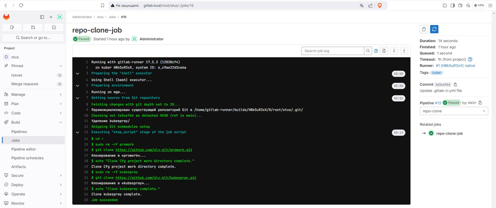

### Кластер bootstrap - bootstrap
На данной стадии с помощью ansible и конфигурации kubespray запускается bootstrap кластера


### Установка контроля над кластером - cluster-ctrl
На данной стадии на управляющую машину копируется конфиг kubernetes для управления кластером
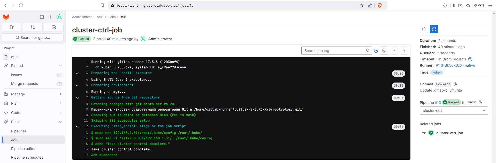

### Настройка кластера после установки - cluster-tune
На данной стадии выполняются 2 действия:
  - запускается скрипт ~/prowork/cluster-tune/tune.sh, который проставляет метки (labels) и таинты (taints) для правильного распределения инфраструктурной и рабочей нагрузки
  - разворачивается MetalLB, который нам обеспечит сетевой доступ к ресурсам - веб-страницам приложений: Minio, Grafana, Argo-CD, Boutique. Установка MetalLB выполняется скриптом ~/prowork/metallb/metallb.sh, который добавляет репозиторий metallb, устанавливает metallb чарт и применяет сетевые настройки с помощью манифеста metallb-pool.yaml:
    ```sh
    helm repo add metallb https://metallb.github.io/metallb
    helm install metallb metallb/metallb --namespace metallb-system --create-namespace
    sleep 60
    kubectl apply -f metallb-pool.yaml
    ```
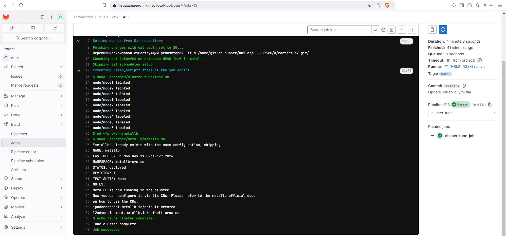

### Развертывание инфраструктурного ПО - deploy-infra
На данной стадии развертывается инфраструктурное ПО:
  - Хранилище S3 - Minio
  - Мониторинг и логирование- стек из Promtail/Prometheus, Loki, Grafana
  - GitOps инструмент для непрерывной доставки ПО - Argo-CD
  
Развертывание происходит исполнением скрипта ~/prowork/deploy-infra/deploy-infra.sh с применением манифестов и конфигурационных файлов "values" из каталога https://github.com/slv-alt/prowork/tree/main/deploy-infra  
Скрипт deploy-infra.sh:
```sh
#!/bin/bash

### Мониторинг

# Для мониторинга развернем S3 хранилище - Minio
# Создадим каталог на node5 для Minio - /
ansible-playbook -i ../ansible/inventory.yaml play-node5-mkdir-mnt-disk1-data.yaml

# Применяем манифест
kubectl apply -f minio.yaml

# В браузере переходим в веб-интерфейс по ссылке http://192.168.1.41:9090/browser и настраиваем корзины и доступ.
# Креды minioadmin:minioadmin
# Создаем корзины: chunks,ruler,admin
# Пользователя с правами RW: loki-user:12345678

sleep 60

# Создадим пространство имен для мониторига
kubectl apply -f ns-monitoring.yaml

# Добавляем Grafana’s chart репозиторий в Helm:
helm repo add grafana https://grafana.github.io/helm-charts

# Устанавливаем Loki
helm install loki grafana/loki --values val-loki.yaml -n monitoring

sleep 60

# Устанавливаем Promtail
helm install promtail grafana/promtail --values val-prom.yaml -n monitoring

sleep 60

# Устанавливаем стек мониторинга
helm repo add prometheus-community https://prometheus-community.github.io/helm-charts
helm install kube-prom-stack prometheus-community/kube-prometheus-stack --values val-kub-prom-stack.yaml -n monitoring

sleep 60

### ПО для деплоя
# Argo

# Добавляем argo chart репозиторий в Helm:
helm repo add argo https://argoproj.github.io/argo-helm

# Установка argo-cd
helm install argo-cd argo/argo-cd --values val-argo-cd.yaml --namespace argo --create-namespace

# Пароль для веб-интерфейса, пользователь admin
#kubectl -n argo get secret argocd-initial-admin-secret -o jsonpath="{.data.password}" | base64 -d
```
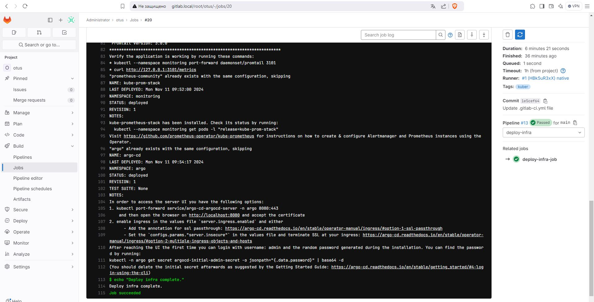

### Развертывание приложения - deploy-soft
На данной стадии развертывается приложение Online Boutique.  
Развертывание происходит исполнением скрипта ~/prowork/deploy-soft/deploy-soft.sh:
```sh
#!/bin/bash

kubectl apply -f ns-onlineboutique.yaml
kubectl apply -f app-butik-argo.yaml
```
Первая строка применяет манифест создания namespace для приложения. Вторая строка применяет манифест создания развертывания приложения в Argo-CD.
Основные настройки этого манифеста заключаются в том, что указывается репозиторий, содержащий приложение, а также настройки автоматической непрерывной доставки.
Репозиторий приложения - это форк оригинального Online Boutique by Google с необходимыми нам настройками.
Адрес форка: https://github.com/slv-alt/boutique.git
Настройки приложения заданы в https://github.com/slv-alt/boutique/blob/main/helm-chart/values.yaml.
Приложение будет автоматически реконфигурироваться при изменении значений в этом файле репозитория.
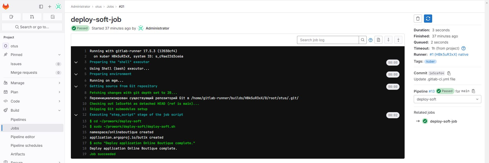

### Окончание этапов автоматического развертывания
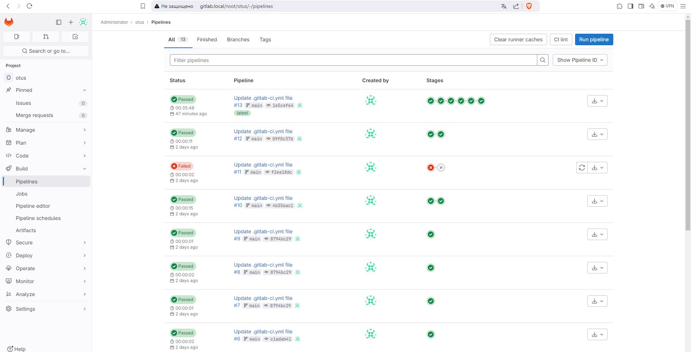

### Приложение в Argo-CD
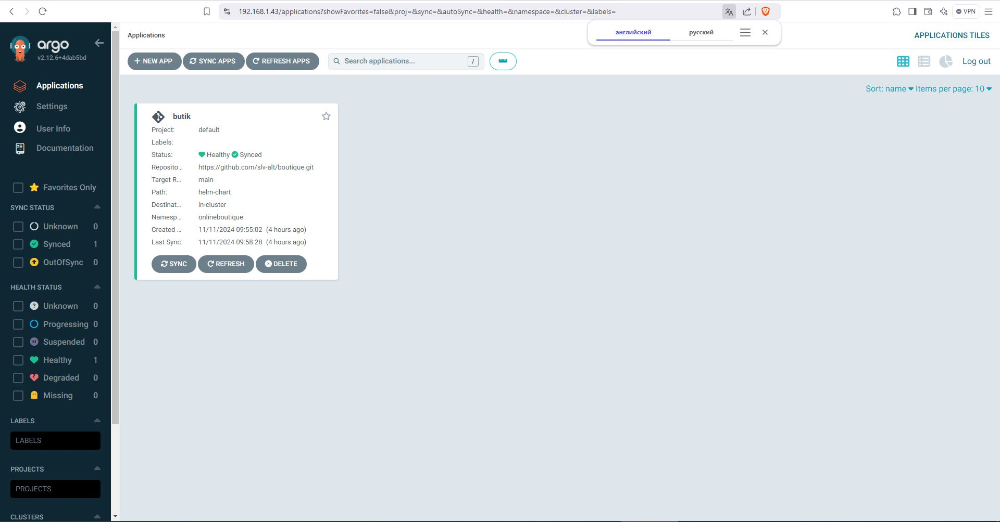

### Приложение в Argo-CD
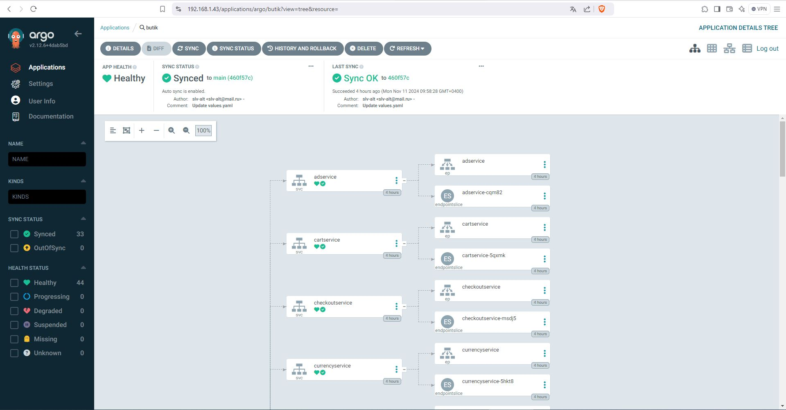

### Веб интерфейс приложения
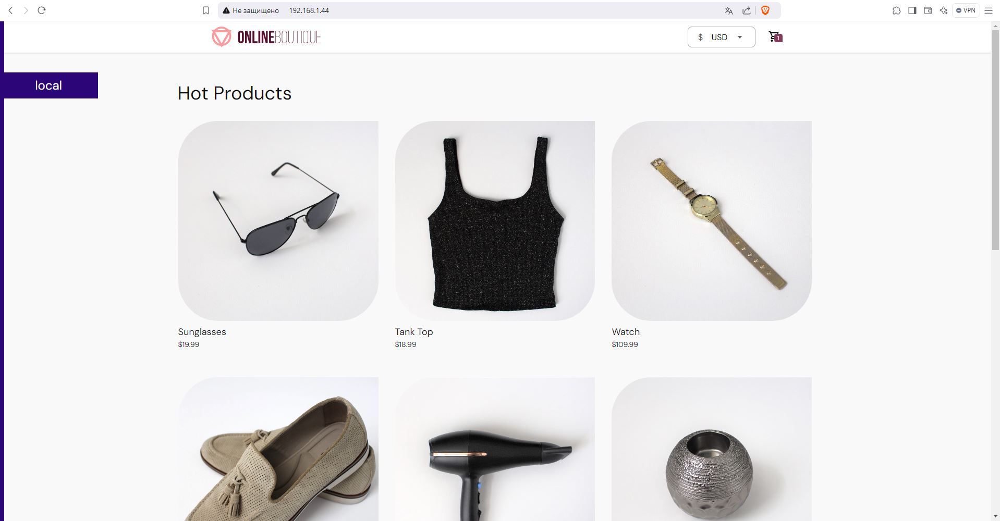

## Мониторинг, централизованное логирование и хранение
Компоненты, отвечающие за мониторинг, логирование и хранение работают на связке:
Promtail-Loki-Grafana-Prometheus-Minio

### Хранилище S3 - Minio
Объектное хранилище необходимо для централизованного хранения логов. Клиентом этого хранилища будет Loki. Развертывание Minio осуществилось в процессе работы gitlab pipeline, применением манифеста deploy-infra/minio.yaml. Ранее, в процессе подготовки кластера, нода node5 была помечена меткой storage=true, также был сделан каталог для хранилища. В комплексе этих настроек данное приложение было запущено именно на node5.  
### Веб-интерфейс Minio
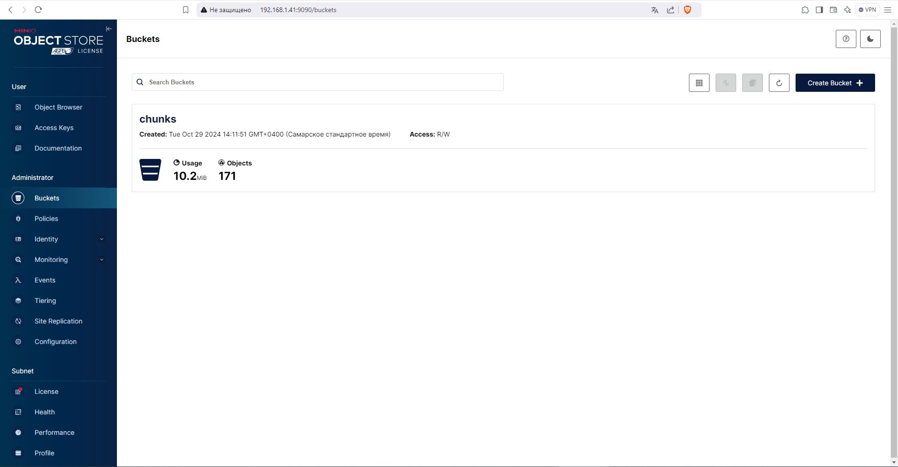

### Loki - система агрегации журналов
Хранит данные в объектном хранилище S3 - Minio. Является источником данных для Grafana. Развертывание Loki осуществилось в процессе работы gitlab pipeline, установкой чарта https://grafana.github.io/helm-charts - grafana/loki, с применением конфигурационного файла deploy-infra/val-loki.yaml

### Promtail
Promtail агент, работающий с Loki. Он отвечает за сбор журналов из различных источников, таких как файлы журналов или журнал systemd, и отправку их в Loki для хранения и индексации. запускается на всех нодах, через установку helm-чарта grafana/promtail с применением конфигурационного файла deploy-infra/val-prom.yaml

### Стек мониторинга кластера и приложения
В данном стеке будут установлены дополнительно Grafana и Prometheus. Стек разворачивается через установку helm-чарта https://prometheus-community.github.io/helm-charts - prometheus-community/kube-prometheus-stack с применением конфигурационного файла deploy-infra/val-kub-prom-stack.yaml

### Grafana - мониторинг кластера
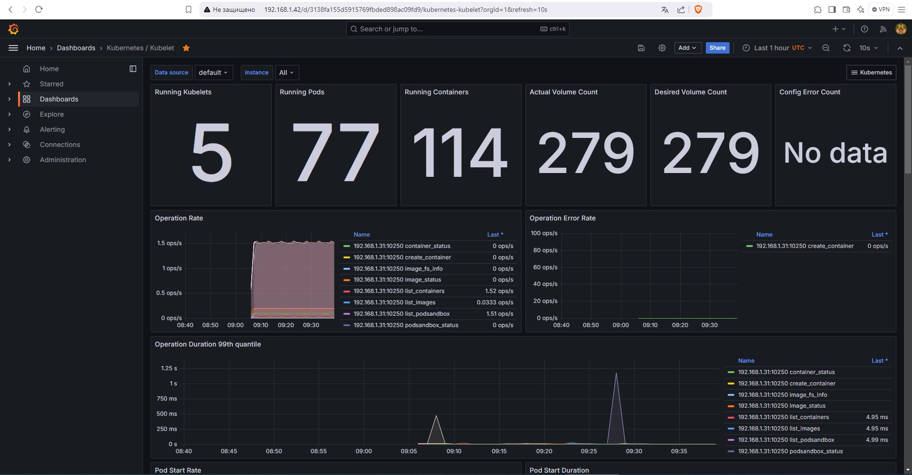

### Grafana - мониторинг кластера
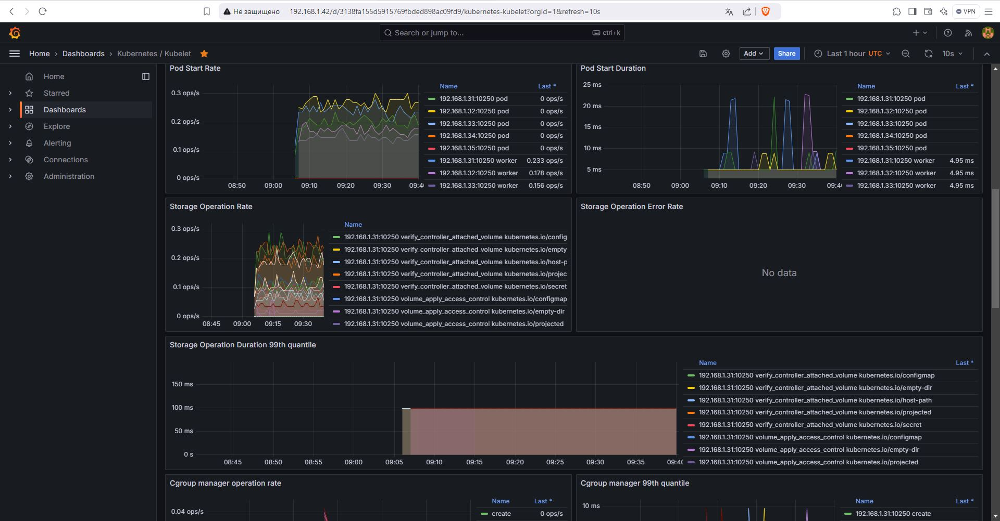

### Grafana - мониторинг кластера -node1


### Grafana - просмотр логов - node5
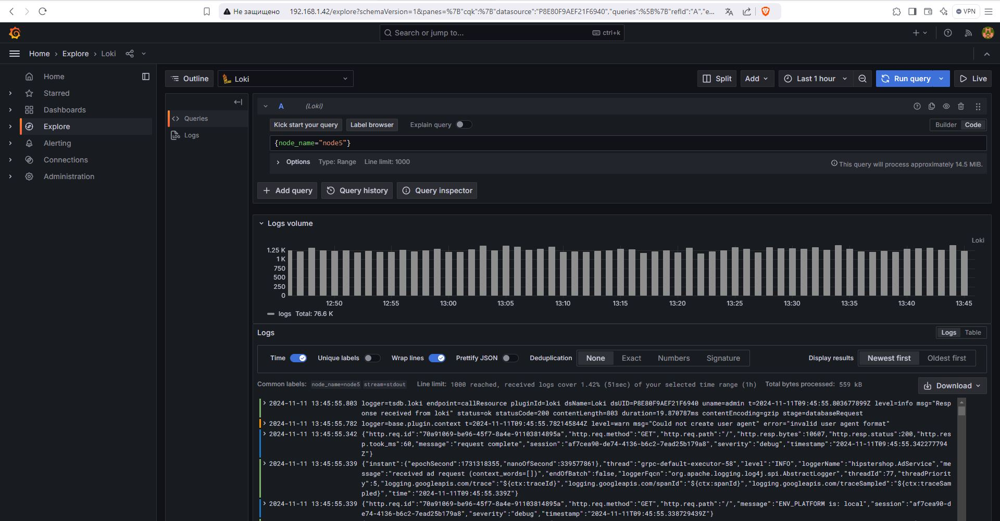

### Grafana - просмотр логов приложения Online Boutique, сервиса frontend
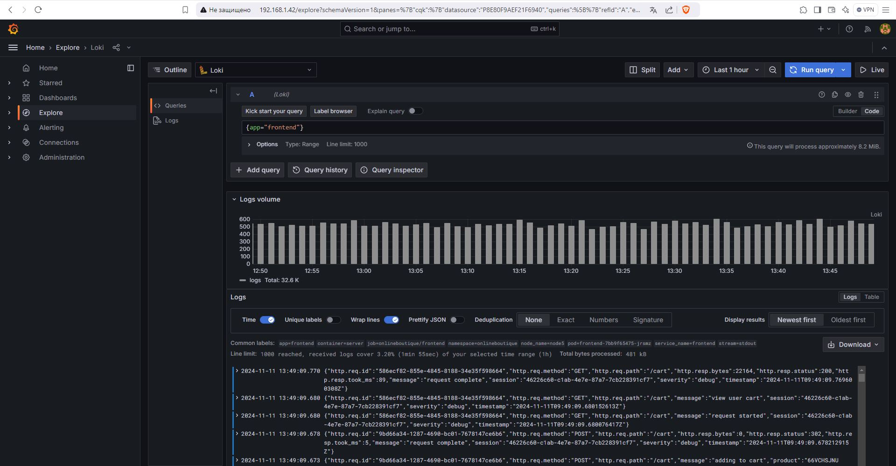

### Grafana - просмотр логов приложения Online Boutique, сервиса loadgenerator
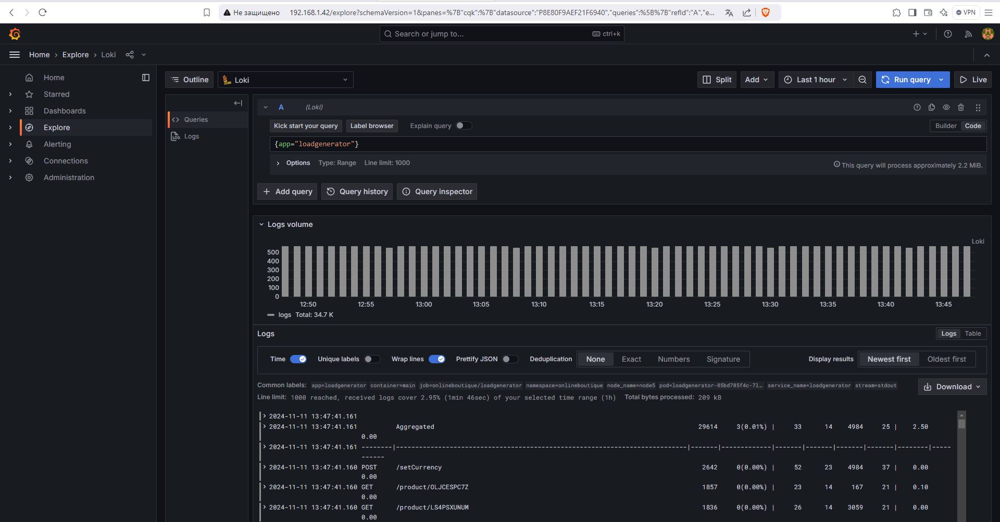

### Grafana - мониторинг приложения Online Boutique
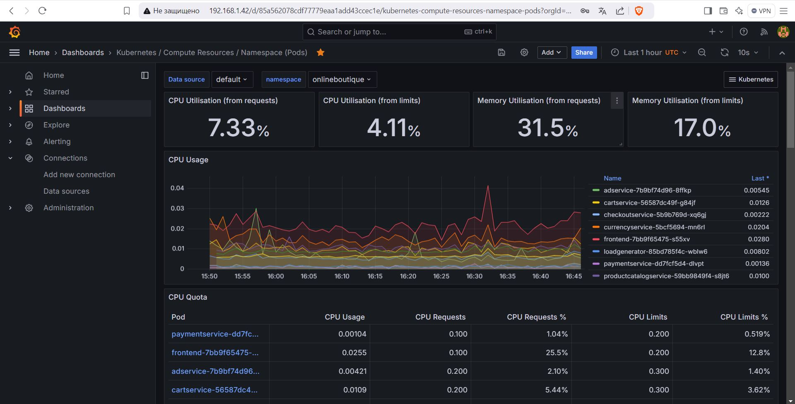

### Grafana - мониторинг приложения Online Boutique
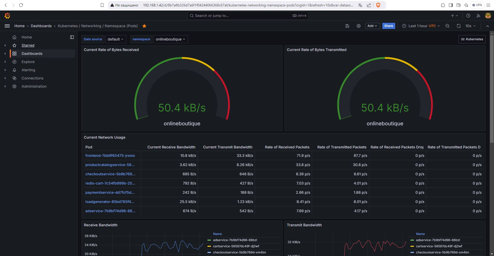

### Grafana - мониторинг приложения Online Boutique
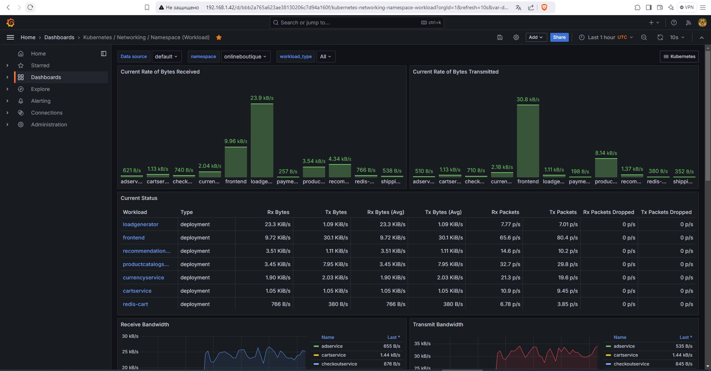

# История подготовки конфигурационных файлов и манифестов, частично

### Argo
Добавляем argo chart репозиторий в Helm:
```sh
helm repo add argo https://argoproj.github.io/argo-helm
```
Проверяем список доступных репозиториев:
```sh
helm repo list
```
Смотрим список доступных чартов:
```sh
helm search repo argo
```
Создаем файл "values.txt" с полным списком значений для чарта argo/argo-cd
```sh
helm show values argo/argo-cd >val-argo-cd.txt
```
Создаем файл val-argo.yaml

Установка argo-cd
```sh
helm install argo-cd argo/argo-cd --values val-argo-cd.yaml --namespace argo --create-namespace
```
### Online Boutique by Google
Клонируем репозиторий для исследования
```sh
git clone --depth 1 --branch v0 https://github.com/GoogleCloudPlatform/microservices-demo.git
```
Пробная установка через helm
```sh
helm upgrade onlineboutique oci://us-docker.pkg.dev/online-boutique-ci/charts/onlineboutique --install --values val-butik.yaml --create-namespace -n onlineboutique
```
Делаем форк Online Boutique by Google в свой репозиторий
```sh
https://github.com/slv-alt/boutique.git
```
В веб интерфейсе Argo создаем приложение - butik  
Получаем данные для манифеста приложения butik для Argo
```sh
kubectl get Application butik -o yaml > app-butik-argo-getApp.yaml
```
На основе полученного файла создаем манифест - app-butik-argo.yaml

Проверка деплоя приложения Boutique через Argo
```sh
kubectl apply -f app-butik-argo.yaml -n argo
```
### S3 хранилище - Minio

С сайта Minio забираем конфиг для развертывания в kubernetes
```sh
curl https://raw.githubusercontent.com/minio/docs/master/source/extra/examples/minio-dev.yaml -O
```
Применяем данный манифест
```sh
kubectl apply -f minio.yaml
```
В браузере переходим в веб-интерфейс по ссылке http://192.168.1.31:9090/browser и настраиваем корзины и доступ.
Креды minioadmin:minioadmin  
Создаем корзины: chunks,ruler,admin

### Monitoring

Добавляем Grafana’s chart репозиторий в Helm:
```sh
helm repo add grafana https://grafana.github.io/helm-charts
```
Проверяем список доступных:
```sh
helm repo list
```

### Loki

Смотрим список доступных приложений grafana репозитория:
```sh
helm search repo grafana
```
Создаем файл "values" с полным списком значений для пакета grafana/loki
```sh
helm show values grafana/loki >val-loki.txt
```
Создаем файл val-loki.yaml

Установка
```sh
helm install --values val-loki.yaml loki grafana/loki -n monitoring
```
### Promtail
Создаем файл "values" с полным списком значений для пакета promtail
```sh
helm show values grafana/promtail >val-prom.txt
```
Создаем файл val-prom.yaml

Устанавливаем Promtail
```sh
helm install --values val-prom.yaml promtail grafana/promtail -n monitoring
```

### Grafana

Создаем файл "values" с полным списком значений для пакета grafana
```sh
helm show values grafana/grafana >val-grafana.txt
```
Создаем файл val-grafana.yaml

Устанавливаем Grafana
```sh
helm install --values val-grafana.yaml grafana grafana/grafana
```

### Готовый стек мониторинга NodeExporter-Prometheus-Grafana
```sh
helm repo add prometheus-community https://prometheus-community.github.io/helm-charts
helm repo list
helm repo update
helm search repo prometheus-community
kubectl create namespace monitoring
helm install kube-prom-stack prometheus-community/kube-prometheus-stack --values val-kub-prom-stack.yaml -n monitoring
```
